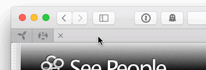

# EasySafari Plugin

The EasySafari plugin works by adding a link to a black and transparent SVG file containing your logo. (You will need to make this file… sorry).

Each page of your Joomla website will have the link tag added to the head so that no matter which page you/your users "pin" in Safari the icon will be your custom one.

To see this plugin working, simply open this website in Safari version 9.0 (or later) and drag the tab to the left side of the window. As you approach the left side of the Tab Bar you will see an animation similar to this one shown below:

## Basic Usage Steps

There's only a few things to do to get up and running. The first is to create a black and transparent version of your icon and save it as an SVG file. Upload that file to your `/images` directory of your Joomla website.

  1. Install via the standard Joomla extension manager and enable it.
  2. open the plugin and set it up.  
    a. select your icon's svg file  
    b. specify the colour to use
  3. save your settings
  4.  _There is no step 4…_

## Notes
 - This plugin only supports Joomla 2.5 & 3.4+
